## Summary note of the phonon olympics entry for AlN

- **Author**: Terumasa TADANO (NIMS)
- **Date**: Feb. 28, 2023.
- **Codes**: VASP 6.2.1 + ALAMODE 1.4.2 (some new features of dev branch are also tested)
- **Compilers**: Intel Compiler version 20.0.2.254 + Intel MKL
- **Compile flags**: `-O2` for ALAMODE, `-O2 -xHOST` for VASP
- **MPI library**: HPE MPI 2.21
- **Computer Resource**: NIMS simulator (Intel Xeon Platinum 8268 24core 2.9 GHz x 2 / node)

## 1. Structure - summary

The calculations were performed using `VASP` code with the following input parameters:
```
 PREC = Accurate
 ENCUT = 550
 EDIFF = 1.0e-8
 EDIFFG = -0.5e-3
 ISMEAR = 0
 SIGMA = 0.05
 ALGO= Normal
 LREAL = .FALSE.
 ADDGRID = .TRUE.
 LWAVE = .FALSE.
 LCHARG = .FALSE.
 ICHARG= 2
 ISTART=0
 NELM=200

 NPAR = 12
 KPAR = 4
 ISIF = 3
 IBRION = 1
 NSW = 100
 POTIM = 0.1

 GGA = PS
 LAPSH = .True.
 ```

As shown in the tables and figures below, the lattice constants appear to reach convergence at the 12x12x8 k points and `ENCUT=550`. 

- **ENCUT = 550**
- **12x12x8 k points for primitive**
- **a = 3.114 Angstrom**
- **c = 4.983 Angstrom**
- **u = 0.382**


    
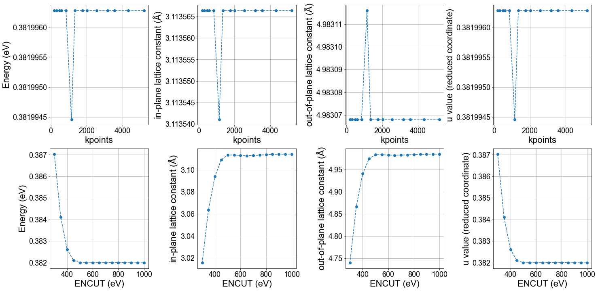
    


## 2. Electronic - summary
The electronic band dispersion obtained from the 12x12x8 k points agrees well with the result obtained from the denser 20x20x13 k points. So, we conclude that 12x12x8 kpoints was accurate enough.


    
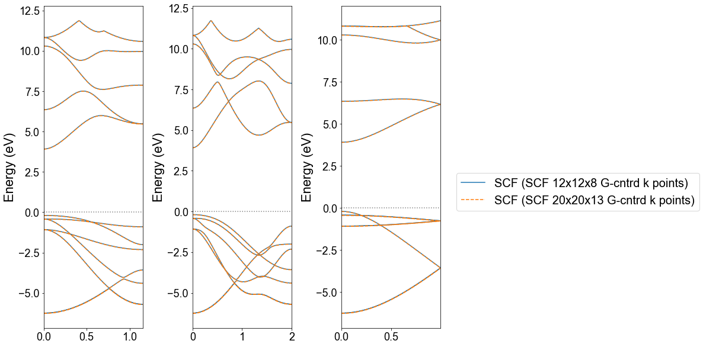
    


## 3.1 Harmonic - convergence at G and M points

The phonon frequencies at Gamma (0,0,0) points are calculated using the following conditions:

- primitive cell (4 atoms)
- displacement magnitude : 0.01 Angstrom
- make full use of symmetry (permutation, space group)
- consider ASR as constraint
- Fit displacement-force dataset by ordinary least squares


    
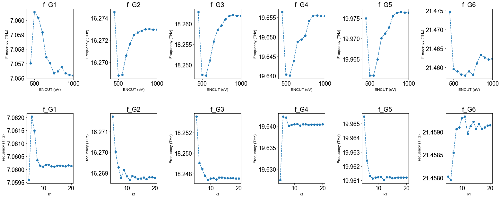
    


## 3.2 Harmonic - convergence of dispersion

To examine the convergence of phonon dispersion curves, we have performed phonon calculations using various supercells and k points as summarized below:


<div>
<style scoped>
    .dataframe tbody tr th:only-of-type {
        vertical-align: middle;
    }

    .dataframe tbody tr th {
        vertical-align: top;
    }

    .dataframe thead th {
        text-align: right;
    }
</style>
<table border="1" class="dataframe">
  <thead>
    <tr style="text-align: right;">
      <th></th>
      <th>Supercell (SC) size</th>
      <th># atoms in SC</th>
      <th>ENCUT</th>
      <th>k mesh style</th>
      <th>k mesh</th>
      <th>k mesh shift</th>
      <th>Core hours</th>
      <th>magnitude of\ndisplacement (Ang.)</th>
    </tr>
  </thead>
  <tbody>
    <tr>
      <th>0</th>
      <td>111</td>
      <td>4</td>
      <td>550.0</td>
      <td>Gamma</td>
      <td>[12, 12, 8]</td>
      <td>[0.0, 0.0, 0.0]</td>
      <td>1.441013</td>
      <td>0.01</td>
    </tr>
    <tr>
      <th>1</th>
      <td>222</td>
      <td>32</td>
      <td>550.0</td>
      <td>Gamma</td>
      <td>[6, 6, 4]</td>
      <td>[0.0, 0.0, 0.0]</td>
      <td>17.772160</td>
      <td>0.01</td>
    </tr>
    <tr>
      <th>2</th>
      <td>332</td>
      <td>72</td>
      <td>550.0</td>
      <td>Gamma</td>
      <td>[4, 4, 4]</td>
      <td>[0.0, 0.0, 0.0]</td>
      <td>48.105067</td>
      <td>0.01</td>
    </tr>
    <tr>
      <th>3</th>
      <td>442</td>
      <td>128</td>
      <td>550.0</td>
      <td>Gamma</td>
      <td>[3, 3, 4]</td>
      <td>[0.0, 0.0, 0.0]</td>
      <td>128.332427</td>
      <td>0.01</td>
    </tr>
    <tr>
      <th>4</th>
      <td>443</td>
      <td>192</td>
      <td>550.0</td>
      <td>Gamma</td>
      <td>[3, 3, 3]</td>
      <td>[0.0, 0.0, 0.0]</td>
      <td>233.681227</td>
      <td>0.01</td>
    </tr>
  </tbody>
</table>
</div>


The results are plotted in the **figure below.**


    
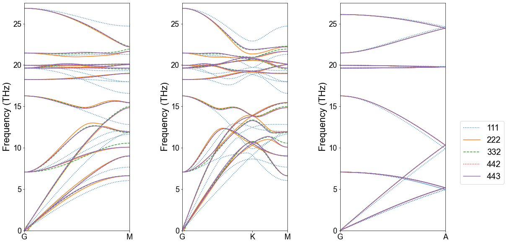
    


    <matplotlib.legend.Legend at 0x1828b8bb0>


    
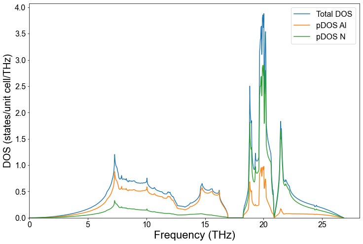
    


## 4.1 Anharmonic - convergence w.r.t. cutoff radius, supercell size, and the size of the training data

The result of the convergence check with respect to the cutoff radius for the third-order IFC is shown in the table and figures below.

The force constants are calculated with the following methods:

- Random displacements of all atoms with magnitude of 0.03 Ang. 
- Full space group symmetry considered
- Impose ASR as constraints
- Estimate third-order IFCs by ordinary least squares, LASSO and adaptive-LASSO (optional)
- **When fitting the third-order IFCs, the second-order IFCs are fixed to the values obtained in the step 3.**

The thermal conductivity calculations are performed with the following conditions:

- 13x13x9 q points
- Use space group symmetry for reducing sampling q points and triplets (q, q', q'')
- Tetrahedron method (`ISMEAR = -1`) for delta function evaluation
- Atomic mass : 26.9815384 au (Al), 14.003074 au (N)
- RTA
- no ph-iso scattering, no ph-boundary effects
- Phonon group velocity is evaluated as $\boldsymbol{v}_{\boldsymbol{q}j} \approx (\omega_{\boldsymbol{q}+\Delta\boldsymbol{q}j} - \omega_{\boldsymbol{q}-\Delta\boldsymbol{q}j})/2\Delta\boldsymbol{q}$ where $\Delta\boldsymbol{q}$ is a small value (~0.001).
- Nonanalytic correction with Ewald method.


    <matplotlib.colorbar.Colorbar at 0x16ee23430>


    
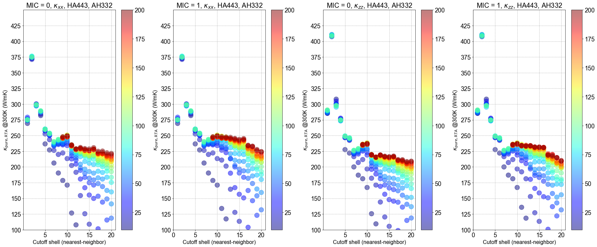
    


    <matplotlib.colorbar.Colorbar at 0x16fb3bf10>


    
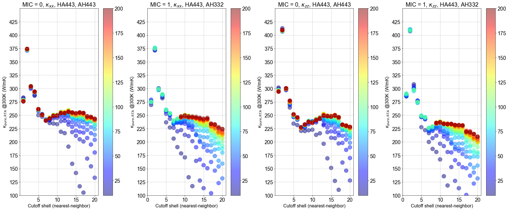
    


    <matplotlib.colorbar.Colorbar at 0x16ff87eb0>


    
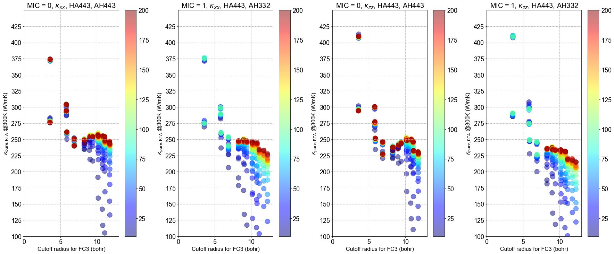
    


    <matplotlib.legend.Legend at 0x1755c4730>


    
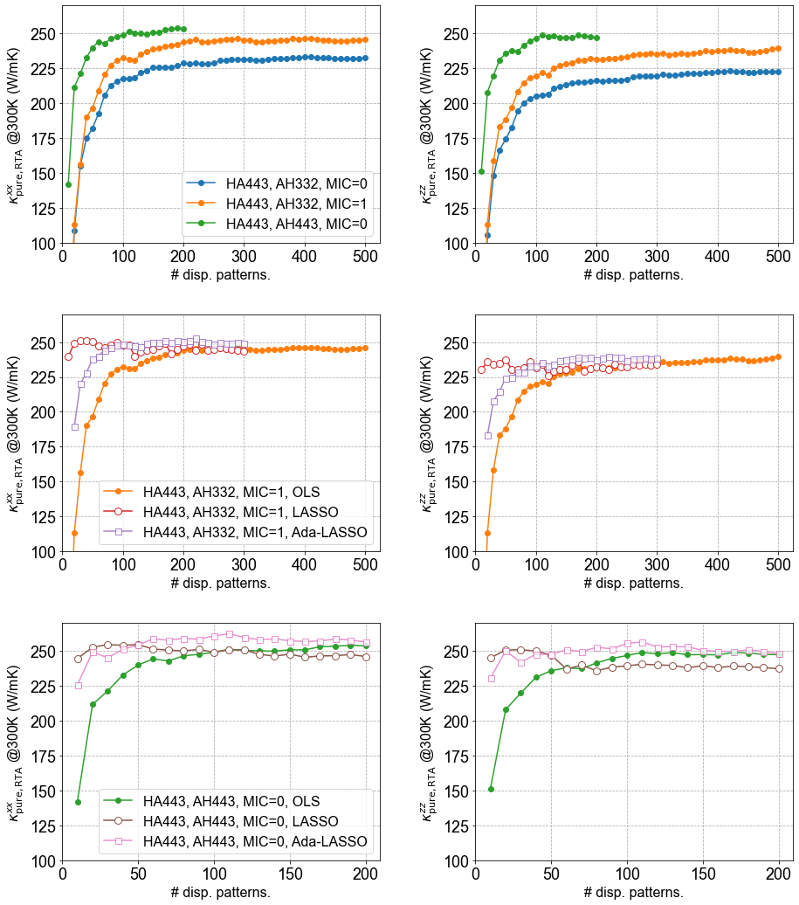
    


## 4.2 Anharmonic - convergence w.r.t. q mesh

The convergence of $\kappa_{L}$ with respect to the q point density was examined using the following computational conditions:

- 4x4x3 supercell for second-order and third-order IFCs
- RTA
- No isotope scattering


    <matplotlib.legend.Legend at 0x17bbb0d60>


    
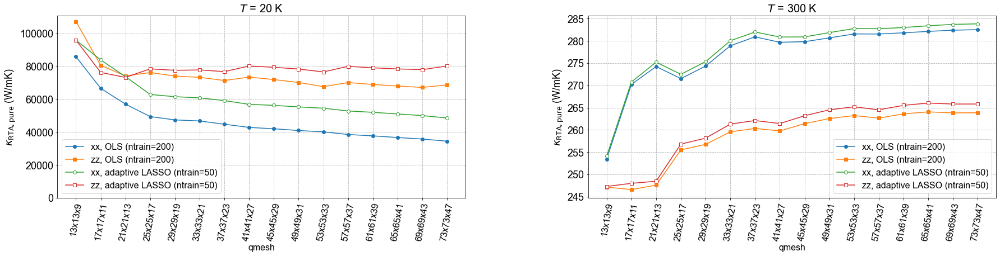
    


    <matplotlib.legend.Legend at 0x17ba18e80>


    
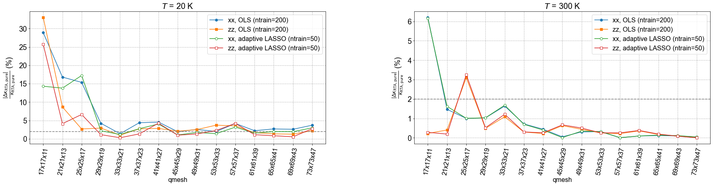
    


## 4. Anharmonic - production run

After checking the convergence of kappa w.r.t. various parameters, I have chosen the following set of parameters for the production calculation.

- Lattice constant (Ang.) : a = 3.1135, c = 4.9831
- ENCUT = 550
- SC for IFC2: `443`
- SC for IFC3: `443`
- Cutoff radius for IFC3 (bohr): 10.74 (includes up to 15NN shells)
- 55x55x33 q points
- tetrahedron method for delta function
- Mass of Al : 26.9815384 au
- Mass of N : 14.003074 au
- temperature step: 10 K

The results of the production calculation are shown in the following tables/figures.


    
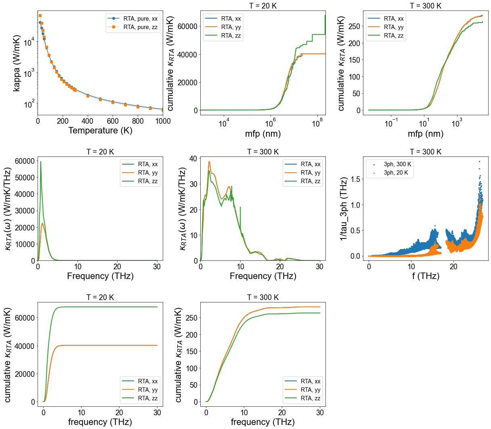
    

