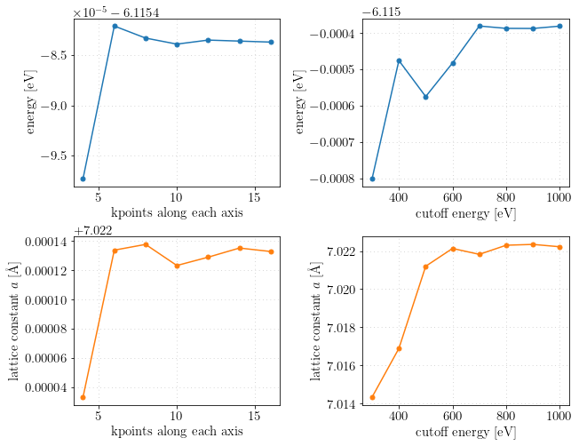
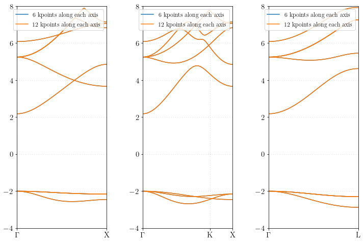
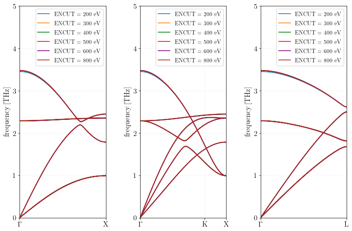
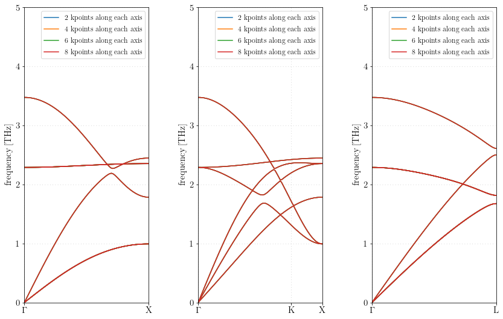
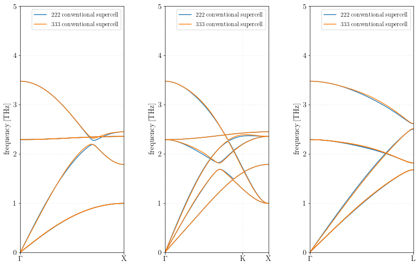
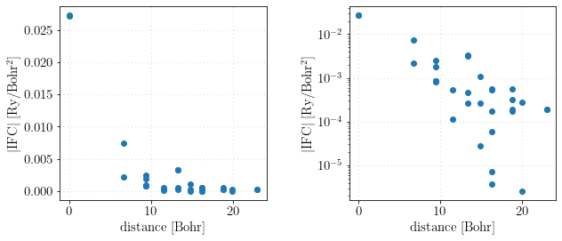
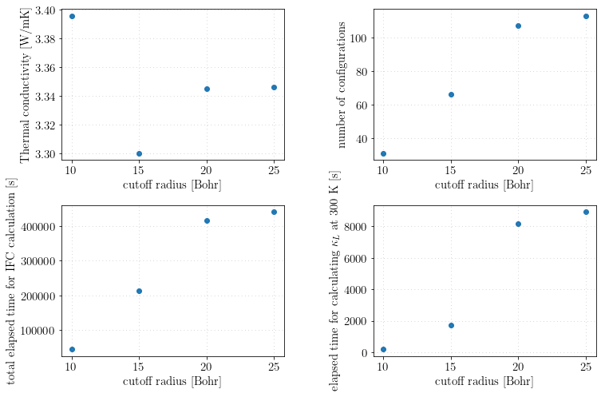
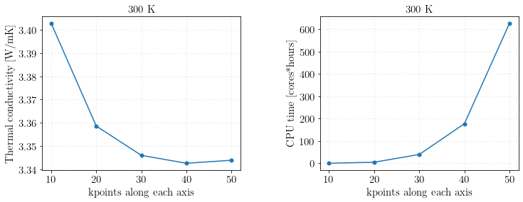
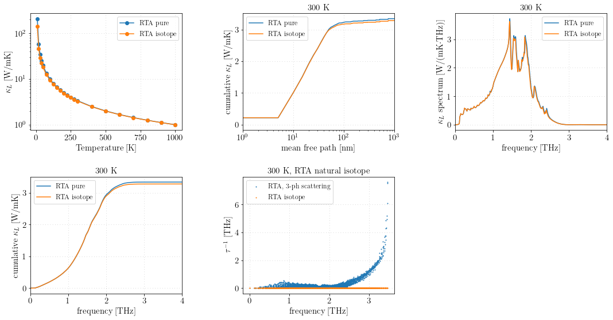

## Summary note of the phonon olympics entry for RbBr

- **Author**: Ryota MASUKI (The Univ. of Tokyo)
- **Date**: April. 27, 2022.
- **Codes**: VASP 6.2.0 + ALAMODE 1.3.0 (some new features of dev branch are also tested)

### VASP
- **Compilers**: Intel Compiler version 15.0.4 + Intel MKL  
- **Compile flags**: -O2
- **MPI library**: Intel MPI 5.1.3.210
- **Computer Resource**: Intel Xeon E5-2698v3, 2.3GHz, 16core x 2 / node

### ALAMODE


- **Compilers**: Intel Compiler version 18.0.2 + Intel MKL  
- **Compile flags**: -O2 -xHOST
- **MPI library**: Intel MPI 2018.2.199
- **Computer Resource**: Xeon Gold 6142, 2.60GHz, 16core x 2 / node

    /usr/local/Cellar/python@3.9/3.9.12/Frameworks/Python.framework/Versions/3.9/lib/python3.9/_collections_abc.py:941: MatplotlibDeprecationWarning: Support for setting the 'text.latex.preamble' or 'pgf.preamble' rcParam to a list of strings is deprecated since 3.3 and will be removed two minor releases later; set it to a single string instead.
      self[key] = other[key]


    5.3088374588761456


## 1. Structure - summary

The calculations were performed using `VASP` code with the following input parameters:
```
SYSTEM = RbBr_primitive
EDIFF = 1.0e-8
PREC = A

ENCUT= 600
ADDGRID = .TRUE.
LREAL=.FALSE.
ISMEAR = 0
SIGMA = 0.05

NPAR = 16
NCORE = 1

LWAVE = .FALSE.
LCHARG = .FALSE.

ISIF = 3
NSW = 100
IBRION = 2

GGA = PE
```

As shown in the tables and figures below, the lattice constant obtained from the variable-cell relaxation (`ISIF=3`) appears to reach convergence at 6x6x6 k points and `ENCUT=600`. So, I have chosen

- **a = 7.0221 Angstrom**


    

    


The detailed information on each calculation is summarized in the tables below.


<div>
<style scoped>
    .dataframe tbody tr th:only-of-type {
        vertical-align: middle;
    }

    .dataframe tbody tr th {
        vertical-align: top;
    }

    .dataframe thead th {
        text-align: right;
    }
</style>
<table border="1" class="dataframe">
  <thead>
    <tr style="text-align: right;">
      <th></th>
      <th>cutoff [eV]</th>
      <th>k points along each axis</th>
      <th>ionic steps</th>
      <th>num of cores</th>
      <th>elapsed time [s]</th>
      <th>computational time [cores*hours]</th>
      <th>total energy [eV]</th>
      <th>lattice constant [Ang]</th>
    </tr>
  </thead>
  <tbody>
    <tr>
      <th>0</th>
      <td>600.0</td>
      <td>4.0</td>
      <td>3.0</td>
      <td>16.0</td>
      <td>16.435</td>
      <td>0.073044</td>
      <td>-6.115497</td>
      <td>7.022033</td>
    </tr>
    <tr>
      <th>1</th>
      <td>600.0</td>
      <td>6.0</td>
      <td>3.0</td>
      <td>16.0</td>
      <td>28.988</td>
      <td>0.128836</td>
      <td>-6.115482</td>
      <td>7.022134</td>
    </tr>
    <tr>
      <th>2</th>
      <td>600.0</td>
      <td>8.0</td>
      <td>3.0</td>
      <td>16.0</td>
      <td>35.094</td>
      <td>0.155973</td>
      <td>-6.115483</td>
      <td>7.022138</td>
    </tr>
    <tr>
      <th>3</th>
      <td>600.0</td>
      <td>10.0</td>
      <td>3.0</td>
      <td>16.0</td>
      <td>67.955</td>
      <td>0.302022</td>
      <td>-6.115484</td>
      <td>7.022123</td>
    </tr>
    <tr>
      <th>4</th>
      <td>600.0</td>
      <td>12.0</td>
      <td>3.0</td>
      <td>16.0</td>
      <td>135.050</td>
      <td>0.600222</td>
      <td>-6.115483</td>
      <td>7.022129</td>
    </tr>
    <tr>
      <th>5</th>
      <td>600.0</td>
      <td>14.0</td>
      <td>3.0</td>
      <td>16.0</td>
      <td>150.873</td>
      <td>0.670547</td>
      <td>-6.115484</td>
      <td>7.022135</td>
    </tr>
    <tr>
      <th>6</th>
      <td>600.0</td>
      <td>16.0</td>
      <td>3.0</td>
      <td>16.0</td>
      <td>196.029</td>
      <td>0.871240</td>
      <td>-6.115484</td>
      <td>7.022133</td>
    </tr>
  </tbody>
</table>
</div>


<div>
<style scoped>
    .dataframe tbody tr th:only-of-type {
        vertical-align: middle;
    }

    .dataframe tbody tr th {
        vertical-align: top;
    }

    .dataframe thead th {
        text-align: right;
    }
</style>
<table border="1" class="dataframe">
  <thead>
    <tr style="text-align: right;">
      <th></th>
      <th>cutoff [eV]</th>
      <th>kpoints along each axis</th>
      <th>ionic steps</th>
      <th>num of cores</th>
      <th>elapsed time [s]</th>
      <th>computational time [cores*hours]</th>
      <th>total energy [eV]</th>
      <th>lattice constant [Ang]</th>
    </tr>
  </thead>
  <tbody>
    <tr>
      <th>0</th>
      <td>300.0</td>
      <td>6</td>
      <td>3.0</td>
      <td>16.0</td>
      <td>9.678</td>
      <td>0.043013</td>
      <td>-6.115800</td>
      <td>7.014344</td>
    </tr>
    <tr>
      <th>1</th>
      <td>400.0</td>
      <td>6</td>
      <td>3.0</td>
      <td>16.0</td>
      <td>10.113</td>
      <td>0.044947</td>
      <td>-6.115475</td>
      <td>7.016894</td>
    </tr>
    <tr>
      <th>2</th>
      <td>500.0</td>
      <td>6</td>
      <td>3.0</td>
      <td>16.0</td>
      <td>20.334</td>
      <td>0.090373</td>
      <td>-6.115574</td>
      <td>7.021202</td>
    </tr>
    <tr>
      <th>3</th>
      <td>600.0</td>
      <td>6</td>
      <td>3.0</td>
      <td>16.0</td>
      <td>27.572</td>
      <td>0.122542</td>
      <td>-6.115482</td>
      <td>7.022134</td>
    </tr>
    <tr>
      <th>4</th>
      <td>700.0</td>
      <td>6</td>
      <td>3.0</td>
      <td>16.0</td>
      <td>32.596</td>
      <td>0.144871</td>
      <td>-6.115380</td>
      <td>7.021825</td>
    </tr>
    <tr>
      <th>5</th>
      <td>800.0</td>
      <td>6</td>
      <td>3.0</td>
      <td>16.0</td>
      <td>45.660</td>
      <td>0.202933</td>
      <td>-6.115387</td>
      <td>7.022303</td>
    </tr>
    <tr>
      <th>6</th>
      <td>900.0</td>
      <td>6</td>
      <td>4.0</td>
      <td>16.0</td>
      <td>70.426</td>
      <td>0.313004</td>
      <td>-6.115387</td>
      <td>7.022346</td>
    </tr>
    <tr>
      <th>7</th>
      <td>1000.0</td>
      <td>6</td>
      <td>4.0</td>
      <td>16.0</td>
      <td>92.253</td>
      <td>0.410013</td>
      <td>-6.115381</td>
      <td>7.022222</td>
    </tr>
  </tbody>
</table>
</div>


## 2. Electronic - summary
The electronic band dispersion obtained from the 6x6x6 k points agrees well with the result obtained from the denser 12x12x12 k points. So, we conclude that 6x6x6 kpoints was accurate enough.

The VASP inputs are basically the same with the calculation 1, except for the setting of the structural relaxation.
All the input files are located in the input folder.

    /Users/ryotamasuki/Documents/Packages/mypythonenv/lib/python3.9/site-packages/pymatgen/io/vasp/outputs.py:1014: UserWarning: No POTCAR file with matching TITEL fields was found in /Users/ryotamasuki/Documents/Research/202202_PhononOlympics/RbBr/2_band_structure/analysis/kpoints666/nscf_seg1
      warnings.warn("No POTCAR file with matching TITEL fields" " was found in {}".format(os.path.abspath(p)))
    /Users/ryotamasuki/Documents/Packages/mypythonenv/lib/python3.9/site-packages/pymatgen/io/vasp/outputs.py:1014: UserWarning: No POTCAR file with matching TITEL fields was found in /Users/ryotamasuki/Documents/Research/202202_PhononOlympics/RbBr/2_band_structure/analysis/kpoints666/nscf_seg2
      warnings.warn("No POTCAR file with matching TITEL fields" " was found in {}".format(os.path.abspath(p)))
    /Users/ryotamasuki/Documents/Packages/mypythonenv/lib/python3.9/site-packages/pymatgen/io/vasp/outputs.py:1014: UserWarning: No POTCAR file with matching TITEL fields was found in /Users/ryotamasuki/Documents/Research/202202_PhononOlympics/RbBr/2_band_structure/analysis/kpoints666/nscf_seg3
      warnings.warn("No POTCAR file with matching TITEL fields" " was found in {}".format(os.path.abspath(p)))
    /Users/ryotamasuki/Documents/Packages/mypythonenv/lib/python3.9/site-packages/pymatgen/io/vasp/outputs.py:1014: UserWarning: No POTCAR file with matching TITEL fields was found in /Users/ryotamasuki/Documents/Research/202202_PhononOlympics/RbBr/2_band_structure/analysis/kpoints121212/nscf_seg1
      warnings.warn("No POTCAR file with matching TITEL fields" " was found in {}".format(os.path.abspath(p)))
    /Users/ryotamasuki/Documents/Packages/mypythonenv/lib/python3.9/site-packages/pymatgen/io/vasp/outputs.py:1014: UserWarning: No POTCAR file with matching TITEL fields was found in /Users/ryotamasuki/Documents/Research/202202_PhononOlympics/RbBr/2_band_structure/analysis/kpoints121212/nscf_seg2
      warnings.warn("No POTCAR file with matching TITEL fields" " was found in {}".format(os.path.abspath(p)))
    /Users/ryotamasuki/Documents/Packages/mypythonenv/lib/python3.9/site-packages/pymatgen/io/vasp/outputs.py:1014: UserWarning: No POTCAR file with matching TITEL fields was found in /Users/ryotamasuki/Documents/Research/202202_PhononOlympics/RbBr/2_band_structure/analysis/kpoints121212/nscf_seg3
      warnings.warn("No POTCAR file with matching TITEL fields" " was found in {}".format(os.path.abspath(p)))


    

    


<div>
<style scoped>
    .dataframe tbody tr th:only-of-type {
        vertical-align: middle;
    }

    .dataframe tbody tr th {
        vertical-align: top;
    }

    .dataframe thead th {
        text-align: right;
    }
</style>
<table border="1" class="dataframe">
  <thead>
    <tr style="text-align: right;">
      <th></th>
      <th>kpoints along each axis</th>
      <th>cutoff [eV]</th>
      <th>num of cores</th>
      <th>elapsed time [s]</th>
      <th>computational time [cores*hours]</th>
    </tr>
  </thead>
  <tbody>
    <tr>
      <th>0</th>
      <td>6.0</td>
      <td>600</td>
      <td>16</td>
      <td>50.167</td>
      <td>0.222964</td>
    </tr>
    <tr>
      <th>1</th>
      <td>12.0</td>
      <td>600</td>
      <td>16</td>
      <td>80.496</td>
      <td>0.357760</td>
    </tr>
  </tbody>
</table>
</div>


    (1, 101)


    (8, 101)


## 3 Harmonic - convergence at G, X, and L points

The phonon frequencies at Gamma (0,0,0), X(0.5, 0.5, 0), and L(0.5, 0.5, 0.5) points are calculated using the following conditions:

- displacement magnitude : 0.01 Angstrom
- make full use of symmetry (permutation, space group)
- consider ASR as constraint
- Fit displacement-force dataset by ordinary least squares
- standard atomic masses
- long-range Coulomb corrections: Ewald method (NONANALYTIC = 3 in ALAMODE)


The results of convergence check with respect to wavefunction cutoff (`ENCUT`), the number of kpoints along each axis, and the size of the supercell are shown in the tables and figures. 
From the result of these convergence checks, we have concluded that the following settings generates well converged harmonic phonon dispersion.

- 2x2x2 conventional supercell (64 atoms)
- wavefunction cutoff(ENCUT) : 300 eV
- kpoints in DFT calculation : 2 x 2 x 2

The calculation results regarding the converged harmonic phonon dispersion is summarized in `result/3_harmonic_phonon` folder.

- phonon dispersion on high-symmetry lines (segment 1~3) : phband.xlsx
- harmonic force constants: RbBr222.xml
- Dielectric matrix and Born effective charges: RbBr.born

### Convergence check with respect to 'ENCUT'

The convergence of phonon frequencies with respect to `ENCUT` is tested.
We use 4x4x4 Monkhorst-Pack kmesh with zero shift.

As shown in the figures and tables below, the target accuracy 0.1 THz is achieved at with `ENCUT` = 200 eV.  

We use
* `ENCUT` = 300 eV

in the following calculations.


    

    


The phonon dispersion is convergent with `ENCUT` $\geq 300$ eV, which is confirmed by checking the frequencies at high symmetry points.


<div>
<style scoped>
    .dataframe tbody tr th:only-of-type {
        vertical-align: middle;
    }

    .dataframe tbody tr th {
        vertical-align: top;
    }

    .dataframe thead th {
        text-align: right;
    }
</style>
<table border="1" class="dataframe">
  <thead>
    <tr style="text-align: right;">
      <th></th>
      <th>kpoints along each axis</th>
      <th>cutoff [eV]</th>
      <th>f_G1 [THz]</th>
      <th>f_G2 [THz]</th>
      <th>f_X1 [THz]</th>
      <th>f_X2 [THz]</th>
      <th>f_X3 [THz]</th>
      <th>f_X4 [THz]</th>
      <th>f_L1 [THz]</th>
      <th>f_L2 [THz]</th>
      <th>f_L3 [THz]</th>
      <th>f_L4 [THz]</th>
    </tr>
  </thead>
  <tbody>
    <tr>
      <th>0</th>
      <td>4.0</td>
      <td>200.0</td>
      <td>2.279835</td>
      <td>3.445062</td>
      <td>0.987961</td>
      <td>1.779863</td>
      <td>2.344817</td>
      <td>2.436541</td>
      <td>0.987961</td>
      <td>1.804799</td>
      <td>2.484916</td>
      <td>2.608683</td>
    </tr>
    <tr>
      <th>1</th>
      <td>4.0</td>
      <td>300.0</td>
      <td>2.288540</td>
      <td>3.474819</td>
      <td>0.992052</td>
      <td>1.783666</td>
      <td>2.353007</td>
      <td>2.446260</td>
      <td>0.992052</td>
      <td>1.815443</td>
      <td>2.500516</td>
      <td>2.610815</td>
    </tr>
    <tr>
      <th>2</th>
      <td>4.0</td>
      <td>400.0</td>
      <td>2.284566</td>
      <td>3.469165</td>
      <td>0.990257</td>
      <td>1.782981</td>
      <td>2.349312</td>
      <td>2.442584</td>
      <td>0.990257</td>
      <td>1.810573</td>
      <td>2.497394</td>
      <td>2.610433</td>
    </tr>
    <tr>
      <th>3</th>
      <td>4.0</td>
      <td>500.0</td>
      <td>2.283051</td>
      <td>3.469075</td>
      <td>0.986587</td>
      <td>1.780902</td>
      <td>2.347305</td>
      <td>2.440321</td>
      <td>0.986587</td>
      <td>1.806549</td>
      <td>2.493952</td>
      <td>2.610324</td>
    </tr>
    <tr>
      <th>4</th>
      <td>4.0</td>
      <td>600.0</td>
      <td>2.284083</td>
      <td>3.469666</td>
      <td>0.987697</td>
      <td>1.781557</td>
      <td>2.348336</td>
      <td>2.441277</td>
      <td>0.987697</td>
      <td>1.808333</td>
      <td>2.495152</td>
      <td>2.610460</td>
    </tr>
    <tr>
      <th>5</th>
      <td>4.0</td>
      <td>800.0</td>
      <td>2.283803</td>
      <td>3.469423</td>
      <td>0.987260</td>
      <td>1.781399</td>
      <td>2.348173</td>
      <td>2.441238</td>
      <td>0.987260</td>
      <td>1.807629</td>
      <td>2.494903</td>
      <td>2.610293</td>
    </tr>
  </tbody>
</table>
</div>


### Convergence check with respect to 'kpoints along each axis'

The convergence of phonon frequencies with respect to the number of kpoints along each axis is tested.
`ENCUT` is fixed to be 300 eV.
We use Monkhorst-Pack kmesh with shift 0.0 0.0 0.0

The phonon dispersion is only slightly improved when we increase the density of kpoints in the DFT calculations.
The accuracy is much higher than the target accuracy 0.1 THz with a relatively coarse 2x2x2 kmesh. Therefore, we use
* 2x2x2 kmesh for DFT calculations

in the following calculations.


The phonon frequencies at high symmetry points with different kmesh density is as shown in the table below.


    

    


<div>
<style scoped>
    .dataframe tbody tr th:only-of-type {
        vertical-align: middle;
    }

    .dataframe tbody tr th {
        vertical-align: top;
    }

    .dataframe thead th {
        text-align: right;
    }
</style>
<table border="1" class="dataframe">
  <thead>
    <tr style="text-align: right;">
      <th></th>
      <th>kpoints along each axis</th>
      <th>cutoff [eV]</th>
      <th>f_G1 [THz]</th>
      <th>f_G2 [THz]</th>
      <th>f_X1 [THz]</th>
      <th>f_X2 [THz]</th>
      <th>f_X3 [THz]</th>
      <th>f_X4 [THz]</th>
      <th>f_L1 [THz]</th>
      <th>f_L2 [THz]</th>
      <th>f_L3 [THz]</th>
      <th>f_L4 [THz]</th>
    </tr>
  </thead>
  <tbody>
    <tr>
      <th>0</th>
      <td>2.0</td>
      <td>300.0</td>
      <td>2.288371</td>
      <td>3.474709</td>
      <td>0.992039</td>
      <td>1.783606</td>
      <td>2.352909</td>
      <td>2.446224</td>
      <td>0.992039</td>
      <td>1.815420</td>
      <td>2.500469</td>
      <td>2.610987</td>
    </tr>
    <tr>
      <th>1</th>
      <td>4.0</td>
      <td>300.0</td>
      <td>2.288540</td>
      <td>3.474819</td>
      <td>0.992052</td>
      <td>1.783666</td>
      <td>2.353007</td>
      <td>2.446260</td>
      <td>0.992052</td>
      <td>1.815443</td>
      <td>2.500516</td>
      <td>2.610815</td>
    </tr>
    <tr>
      <th>2</th>
      <td>6.0</td>
      <td>300.0</td>
      <td>2.288528</td>
      <td>3.474810</td>
      <td>0.992107</td>
      <td>1.783661</td>
      <td>2.353016</td>
      <td>2.446282</td>
      <td>0.992107</td>
      <td>1.815435</td>
      <td>2.500521</td>
      <td>2.610914</td>
    </tr>
    <tr>
      <th>3</th>
      <td>8.0</td>
      <td>300.0</td>
      <td>2.288513</td>
      <td>3.474801</td>
      <td>0.992142</td>
      <td>1.783650</td>
      <td>2.353004</td>
      <td>2.446249</td>
      <td>0.992142</td>
      <td>1.815447</td>
      <td>2.500456</td>
      <td>2.610942</td>
    </tr>
  </tbody>
</table>
</div>


### Convergence check with respect to supercell size

The convergence of phonon frequencies with respect to the supercell size is tested with following conditions
- `ENCUT` is 300 eV
- 4x4x4 Monkhorst kmesh for DFT calculations


    

    


<div>
<style scoped>
    .dataframe tbody tr th:only-of-type {
        vertical-align: middle;
    }

    .dataframe tbody tr th {
        vertical-align: top;
    }

    .dataframe thead th {
        text-align: right;
    }
</style>
<table border="1" class="dataframe">
  <thead>
    <tr style="text-align: right;">
      <th></th>
      <th>kpoints along each axis</th>
      <th>cutoff [eV]</th>
      <th>f_G1 [THz]</th>
      <th>f_G2 [THz]</th>
      <th>f_X1 [THz]</th>
      <th>f_X2 [THz]</th>
      <th>f_X3 [THz]</th>
      <th>f_X4 [THz]</th>
      <th>f_L1 [THz]</th>
      <th>f_L2 [THz]</th>
      <th>f_L3 [THz]</th>
      <th>f_L4 [THz]</th>
      <th>supercell</th>
    </tr>
  </thead>
  <tbody>
    <tr>
      <th>0</th>
      <td>4.0</td>
      <td>300.0</td>
      <td>2.28854</td>
      <td>3.474819</td>
      <td>0.992052</td>
      <td>1.783666</td>
      <td>2.353007</td>
      <td>2.446260</td>
      <td>0.992052</td>
      <td>1.815443</td>
      <td>2.500516</td>
      <td>2.610815</td>
      <td>222 conventional</td>
    </tr>
    <tr>
      <th>1</th>
      <td>4.0</td>
      <td>300.0</td>
      <td>2.28842</td>
      <td>3.474741</td>
      <td>0.992087</td>
      <td>1.783648</td>
      <td>2.352937</td>
      <td>2.446247</td>
      <td>0.992087</td>
      <td>1.812510</td>
      <td>2.510916</td>
      <td>2.614418</td>
      <td>333 conventional</td>
    </tr>
  </tbody>
</table>
</div>


### Summary of convergence check of frequencies at high-symmetry point

The calculation results on the phonon frequencies at high-symmetry points and the computational times are summarized in the tables below.


<div>
<style scoped>
    .dataframe tbody tr th:only-of-type {
        vertical-align: middle;
    }

    .dataframe tbody tr th {
        vertical-align: top;
    }

    .dataframe thead th {
        text-align: right;
    }
</style>
<table border="1" class="dataframe">
  <thead>
    <tr style="text-align: right;">
      <th></th>
      <th>kpoints along each axis</th>
      <th>cutoff [eV]</th>
      <th>f_G1 [THz]</th>
      <th>f_G2 [THz]</th>
      <th>f_X1 [THz]</th>
      <th>f_X2 [THz]</th>
      <th>f_X3 [THz]</th>
      <th>f_X4 [THz]</th>
      <th>f_L1 [THz]</th>
      <th>f_L2 [THz]</th>
      <th>f_L3 [THz]</th>
      <th>f_L4 [THz]</th>
      <th>supercell</th>
    </tr>
  </thead>
  <tbody>
    <tr>
      <th>0</th>
      <td>4.0</td>
      <td>200.0</td>
      <td>2.279835</td>
      <td>3.445062</td>
      <td>0.987961</td>
      <td>1.779863</td>
      <td>2.344817</td>
      <td>2.436541</td>
      <td>0.987961</td>
      <td>1.804799</td>
      <td>2.484916</td>
      <td>2.608683</td>
      <td>222 conventional</td>
    </tr>
    <tr>
      <th>1</th>
      <td>4.0</td>
      <td>300.0</td>
      <td>2.288540</td>
      <td>3.474819</td>
      <td>0.992052</td>
      <td>1.783666</td>
      <td>2.353007</td>
      <td>2.446260</td>
      <td>0.992052</td>
      <td>1.815443</td>
      <td>2.500516</td>
      <td>2.610815</td>
      <td>222 conventional</td>
    </tr>
    <tr>
      <th>2</th>
      <td>4.0</td>
      <td>400.0</td>
      <td>2.284566</td>
      <td>3.469165</td>
      <td>0.990257</td>
      <td>1.782981</td>
      <td>2.349312</td>
      <td>2.442584</td>
      <td>0.990257</td>
      <td>1.810573</td>
      <td>2.497394</td>
      <td>2.610433</td>
      <td>222 conventional</td>
    </tr>
    <tr>
      <th>3</th>
      <td>4.0</td>
      <td>500.0</td>
      <td>2.283051</td>
      <td>3.469075</td>
      <td>0.986587</td>
      <td>1.780902</td>
      <td>2.347305</td>
      <td>2.440321</td>
      <td>0.986587</td>
      <td>1.806549</td>
      <td>2.493952</td>
      <td>2.610324</td>
      <td>222 conventional</td>
    </tr>
    <tr>
      <th>4</th>
      <td>4.0</td>
      <td>600.0</td>
      <td>2.284083</td>
      <td>3.469666</td>
      <td>0.987697</td>
      <td>1.781557</td>
      <td>2.348336</td>
      <td>2.441277</td>
      <td>0.987697</td>
      <td>1.808333</td>
      <td>2.495152</td>
      <td>2.610460</td>
      <td>222 conventional</td>
    </tr>
    <tr>
      <th>5</th>
      <td>4.0</td>
      <td>800.0</td>
      <td>2.283803</td>
      <td>3.469423</td>
      <td>0.987260</td>
      <td>1.781399</td>
      <td>2.348173</td>
      <td>2.441238</td>
      <td>0.987260</td>
      <td>1.807629</td>
      <td>2.494903</td>
      <td>2.610293</td>
      <td>222 conventional</td>
    </tr>
    <tr>
      <th>0</th>
      <td>2.0</td>
      <td>300.0</td>
      <td>2.288371</td>
      <td>3.474709</td>
      <td>0.992039</td>
      <td>1.783606</td>
      <td>2.352909</td>
      <td>2.446224</td>
      <td>0.992039</td>
      <td>1.815420</td>
      <td>2.500469</td>
      <td>2.610987</td>
      <td>222 conventional</td>
    </tr>
    <tr>
      <th>1</th>
      <td>4.0</td>
      <td>300.0</td>
      <td>2.288540</td>
      <td>3.474819</td>
      <td>0.992052</td>
      <td>1.783666</td>
      <td>2.353007</td>
      <td>2.446260</td>
      <td>0.992052</td>
      <td>1.815443</td>
      <td>2.500516</td>
      <td>2.610815</td>
      <td>222 conventional</td>
    </tr>
    <tr>
      <th>2</th>
      <td>6.0</td>
      <td>300.0</td>
      <td>2.288528</td>
      <td>3.474810</td>
      <td>0.992107</td>
      <td>1.783661</td>
      <td>2.353016</td>
      <td>2.446282</td>
      <td>0.992107</td>
      <td>1.815435</td>
      <td>2.500521</td>
      <td>2.610914</td>
      <td>222 conventional</td>
    </tr>
    <tr>
      <th>3</th>
      <td>8.0</td>
      <td>300.0</td>
      <td>2.288513</td>
      <td>3.474801</td>
      <td>0.992142</td>
      <td>1.783650</td>
      <td>2.353004</td>
      <td>2.446249</td>
      <td>0.992142</td>
      <td>1.815447</td>
      <td>2.500456</td>
      <td>2.610942</td>
      <td>222 conventional</td>
    </tr>
    <tr>
      <th>0</th>
      <td>2.0</td>
      <td>600.0</td>
      <td>2.283961</td>
      <td>3.469588</td>
      <td>0.987664</td>
      <td>1.781453</td>
      <td>2.348261</td>
      <td>2.441251</td>
      <td>0.987664</td>
      <td>1.808322</td>
      <td>2.495155</td>
      <td>2.610450</td>
      <td>222 conventional</td>
    </tr>
    <tr>
      <th>1</th>
      <td>4.0</td>
      <td>600.0</td>
      <td>2.284083</td>
      <td>3.469666</td>
      <td>0.987697</td>
      <td>1.781557</td>
      <td>2.348336</td>
      <td>2.441277</td>
      <td>0.987697</td>
      <td>1.808333</td>
      <td>2.495152</td>
      <td>2.610460</td>
      <td>222 conventional</td>
    </tr>
    <tr>
      <th>2</th>
      <td>8.0</td>
      <td>600.0</td>
      <td>2.284082</td>
      <td>3.469666</td>
      <td>0.987714</td>
      <td>1.781561</td>
      <td>2.348320</td>
      <td>2.441255</td>
      <td>0.987714</td>
      <td>1.808328</td>
      <td>2.495152</td>
      <td>2.610441</td>
      <td>222 conventional</td>
    </tr>
    <tr>
      <th>0</th>
      <td>4.0</td>
      <td>300.0</td>
      <td>2.288540</td>
      <td>3.474819</td>
      <td>0.992052</td>
      <td>1.783666</td>
      <td>2.353007</td>
      <td>2.446260</td>
      <td>0.992052</td>
      <td>1.815443</td>
      <td>2.500516</td>
      <td>2.610815</td>
      <td>222 conventional</td>
    </tr>
    <tr>
      <th>1</th>
      <td>4.0</td>
      <td>300.0</td>
      <td>2.288420</td>
      <td>3.474741</td>
      <td>0.992087</td>
      <td>1.783648</td>
      <td>2.352937</td>
      <td>2.446247</td>
      <td>0.992087</td>
      <td>1.812510</td>
      <td>2.510916</td>
      <td>2.614418</td>
      <td>333 conventional</td>
    </tr>
  </tbody>
</table>
</div>


<div>
<style scoped>
    .dataframe tbody tr th:only-of-type {
        vertical-align: middle;
    }

    .dataframe tbody tr th {
        vertical-align: top;
    }

    .dataframe thead th {
        text-align: right;
    }
</style>
<table border="1" class="dataframe">
  <thead>
    <tr style="text-align: right;">
      <th></th>
      <th>kpoints along each axis</th>
      <th>cutoff [eV]</th>
      <th>number of cores</th>
      <th>total CPU time [s]</th>
      <th>supercell</th>
      <th>computational time [cores*hours]</th>
    </tr>
  </thead>
  <tbody>
    <tr>
      <th>0</th>
      <td>4.0</td>
      <td>200.0</td>
      <td>16.0</td>
      <td>5006.093</td>
      <td>222 conventional</td>
      <td>22.249302</td>
    </tr>
    <tr>
      <th>1</th>
      <td>4.0</td>
      <td>300.0</td>
      <td>16.0</td>
      <td>17005.510</td>
      <td>222 conventional</td>
      <td>75.580044</td>
    </tr>
    <tr>
      <th>2</th>
      <td>4.0</td>
      <td>400.0</td>
      <td>16.0</td>
      <td>33663.777</td>
      <td>222 conventional</td>
      <td>149.616787</td>
    </tr>
    <tr>
      <th>3</th>
      <td>4.0</td>
      <td>600.0</td>
      <td>16.0</td>
      <td>33249.699</td>
      <td>222 conventional</td>
      <td>147.776440</td>
    </tr>
    <tr>
      <th>4</th>
      <td>4.0</td>
      <td>800.0</td>
      <td>16.0</td>
      <td>72985.356</td>
      <td>222 conventional</td>
      <td>324.379360</td>
    </tr>
    <tr>
      <th>5</th>
      <td>2.0</td>
      <td>300.0</td>
      <td>16.0</td>
      <td>6099.531</td>
      <td>222 conventional</td>
      <td>27.109027</td>
    </tr>
    <tr>
      <th>6</th>
      <td>4.0</td>
      <td>300.0</td>
      <td>16.0</td>
      <td>17005.510</td>
      <td>222 conventional</td>
      <td>75.580044</td>
    </tr>
    <tr>
      <th>7</th>
      <td>6.0</td>
      <td>300.0</td>
      <td>16.0</td>
      <td>30476.470</td>
      <td>222 conventional</td>
      <td>135.450978</td>
    </tr>
    <tr>
      <th>8</th>
      <td>8.0</td>
      <td>300.0</td>
      <td>16.0</td>
      <td>35867.435</td>
      <td>222 conventional</td>
      <td>159.410822</td>
    </tr>
    <tr>
      <th>9</th>
      <td>2.0</td>
      <td>600.0</td>
      <td>16.0</td>
      <td>24706.924</td>
      <td>222 conventional</td>
      <td>109.808551</td>
    </tr>
    <tr>
      <th>10</th>
      <td>4.0</td>
      <td>600.0</td>
      <td>16.0</td>
      <td>33249.699</td>
      <td>222 conventional</td>
      <td>147.776440</td>
    </tr>
    <tr>
      <th>11</th>
      <td>8.0</td>
      <td>600.0</td>
      <td>16.0</td>
      <td>180701.723</td>
      <td>222 conventional</td>
      <td>803.118769</td>
    </tr>
    <tr>
      <th>12</th>
      <td>4.0</td>
      <td>300.0</td>
      <td>36.0</td>
      <td>207009.360</td>
      <td>333 conventional</td>
      <td>2070.093600</td>
    </tr>
  </tbody>
</table>
</div>


The number of DFT runs is 2 for each calculation.

\* I am so sorry that the calculation in 3x3x3 supercell is run in a different computer because it took too long in the computer which is used for other calculations. Therefore, the computational time of the 3x3x3 conventional cell cannot be directly compared to the results of the 2x2x2 supercell.

### IFCs in the real space 
The relationship between the atomic distances and the absolute values of finite IFCs are plotted.
The IFCs with large atomic distance close to the supercell size (around 26 Bohr) is small. This shows that the supercell used in the calculation is large enough, which is consistent with the previous calculation.


    

    


## 4-1 Anharmonic thermal conductivity - convergence check with respect to the cutoff radius

The results of the convergence check with respect to the cutoff radius for the third-order IFC and the supercell size are shown in the table and figures below.

The force constants are calculated with the following methods:

- Finite displacements with magnitude of 0.03 Ang.
- Full space group symmetry considered
- Impose ASR as constraints
- Estimate third-order IFCs by ordinary least squares
- **When fitting the third-order IFCs, the second-order IFCs are fixed to the values obtained in the step 3.**

The thermal conductivity calculations are performed with the following conditions:

- 30x30x30 q points
- Use space group symmetry for reducing sampling q points and triplets (q, q', q'')
- Tetrahedron method (`ISMEAR = -1`) for delta function evaluation
- RTA
- We have checked that the default atomic masses agree with the values given in the checklist with the accuracy less than 0.001 u
- no ph-iso scattering, no ph-boundary effects
- Phonon group velocity is evaluated as $\boldsymbol{v}_{\boldsymbol{q}j} \approx (\omega_{\boldsymbol{q}+\Delta\boldsymbol{q}j} - \omega_{\boldsymbol{q}-\Delta\boldsymbol{q}j})/2\Delta\boldsymbol{q}$ where $\Delta\boldsymbol{q}$ is a small value (~0.001).


    

    


<div>
<style scoped>
    .dataframe tbody tr th:only-of-type {
        vertical-align: middle;
    }

    .dataframe tbody tr th {
        vertical-align: top;
    }

    .dataframe thead th {
        text-align: right;
    }
</style>
<table border="1" class="dataframe">
  <thead>
    <tr style="text-align: right;">
      <th></th>
      <th>cutoff radius [Bohr]</th>
      <th>num. of configurations</th>
      <th>num. of cores</th>
      <th>total comp time for anharmonic IFCs [s]</th>
      <th>comp time for kappaL at 300 K [s]</th>
      <th>comp time for anharmonic IFCs [cores*hours]</th>
      <th>comp time for kappaL at 300 K [cores*hours]</th>
    </tr>
  </thead>
  <tbody>
    <tr>
      <th>0</th>
      <td>10.0</td>
      <td>31.0</td>
      <td>16.0</td>
      <td>44103.0</td>
      <td>187.0</td>
      <td>196.013333</td>
      <td>0.831111</td>
    </tr>
    <tr>
      <th>1</th>
      <td>15.0</td>
      <td>66.0</td>
      <td>16.0</td>
      <td>212672.0</td>
      <td>1714.0</td>
      <td>945.208889</td>
      <td>7.617778</td>
    </tr>
    <tr>
      <th>2</th>
      <td>20.0</td>
      <td>107.0</td>
      <td>16.0</td>
      <td>416962.0</td>
      <td>8172.0</td>
      <td>1853.164444</td>
      <td>36.320000</td>
    </tr>
    <tr>
      <th>3</th>
      <td>25.0</td>
      <td>113.0</td>
      <td>16.0</td>
      <td>440448.0</td>
      <td>8903.0</td>
      <td>1957.546667</td>
      <td>39.568889</td>
    </tr>
  </tbody>
</table>
</div>


## 4-2 Anharmonic thermal conductivity - convergence check with respect to the number of kpoints

The convergence of $\kappa_{L}$ with respect to the q point density was examined using the following computational conditions:

- 2x2x2 conventional supercell
- cuoff radius of third-order force constants is 25.0 Bohr
- Increase q mesh from 10^3 to 50^3
- no isotope scattering
- $T$ = 300 K

The thermal conductivity $\kappa_L$ converges to $\kappa_L = 3.34 \sim 3.35 $ W/mK as the density of kmesh gets larger. The target accuracy (2 \% difference between successive grids) is achieved with 20x20x20 kmesh.  
In the production run, we use 30x30x30 kmesh, which produces a value much closer to the converged result.


    

    


<div>
<style scoped>
    .dataframe tbody tr th:only-of-type {
        vertical-align: middle;
    }

    .dataframe tbody tr th {
        vertical-align: top;
    }

    .dataframe thead th {
        text-align: right;
    }
</style>
<table border="1" class="dataframe">
  <thead>
    <tr style="text-align: right;">
      <th></th>
      <th>kpoints along each axis</th>
      <th>thermal conductivity at 300 K [W/mK]</th>
      <th>computational time [cores*hours]</th>
    </tr>
  </thead>
  <tbody>
    <tr>
      <th>0</th>
      <td>10.0</td>
      <td>3.4028</td>
      <td>0.115556</td>
    </tr>
    <tr>
      <th>1</th>
      <td>20.0</td>
      <td>3.3586</td>
      <td>4.715556</td>
    </tr>
    <tr>
      <th>2</th>
      <td>30.0</td>
      <td>3.3460</td>
      <td>39.568889</td>
    </tr>
    <tr>
      <th>3</th>
      <td>40.0</td>
      <td>3.3426</td>
      <td>177.360000</td>
    </tr>
    <tr>
      <th>4</th>
      <td>50.0</td>
      <td>3.3439</td>
      <td>627.924444</td>
    </tr>
  </tbody>
</table>
</div>


## 4. Anharmonic - production run

After checking the convergence of kappa w.r.t. various parameters, I have chosen the following set of parameters for the production calculation.

- Lattice constant (Ang.) : 7.0221 Angstrom
- ENCUT = 300
- supercell: 222 conventional supercell
- Cutoff radius for IFC3 (bohr): 25.0 Bohr
- 30x30x30 q points
- tetrahedron method for delta function
- Mass of Rb: 85.467 u for $\kappa_{nat}$, 84.912 u for $\kappa_{pure}$.
- Mass of Br: 79.904 u for $\kappa_{nat}$, 78.918 u for $\kappa_{pure}$.

- isotope factor of Rb: 1.09653e-04 for $\kappa_{nat}$, 0 for $\kappa_{pure}$ 
- isotope factor of Br: 1.56286e-04 for $\kappa_{nat}$, 0 for $\kappa_{pure}$ 


The results of the production calculation are shown in the following tables/figures.

The CPU time for the thermal conductivity calculation is 
- pure: 30013 s with 16 cores (133.39 cores*hour)
- natural isotope: 25437 s with 16 cores (113.05 cores*hour)


Both calculations are run with 16 cores.

    <ipython-input-77-7f48850cc4ec>:86: RuntimeWarning: divide by zero encountered in true_divide
      ax.scatter(tau_w_isotope_3ph[:,2]/THz_to_kayser/(2.0*np.pi), 1.0/tau_w_isotope_3ph[:,3], color='#1f77b4', s = 1.0, label = "RTA, 3-ph scattering")


    

    


    <ipython-input-80-d326426758fe>:7: RuntimeWarning: divide by zero encountered in true_divide
      freq_invtau_isotope = np.stack([tau_w_isotope[:,2]/THz_to_kayser/(2.0*np.pi), 1.0/tau_w_isotope_3ph[:,3], 1.0/tau_w_isotope[:,3]-1.0/tau_w_isotope_3ph[:,3]])
    <ipython-input-80-d326426758fe>:7: RuntimeWarning: invalid value encountered in subtract
      freq_invtau_isotope = np.stack([tau_w_isotope[:,2]/THz_to_kayser/(2.0*np.pi), 1.0/tau_w_isotope_3ph[:,3], 1.0/tau_w_isotope[:,3]-1.0/tau_w_isotope_3ph[:,3]])

